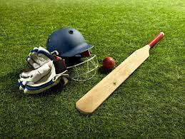
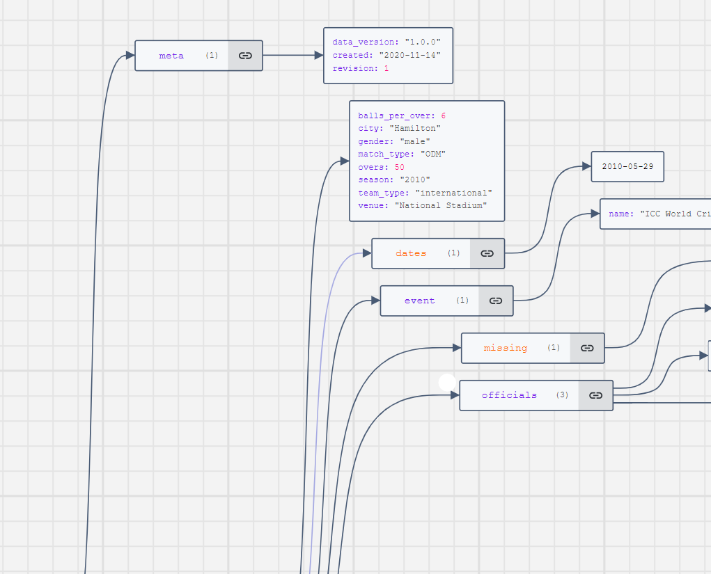
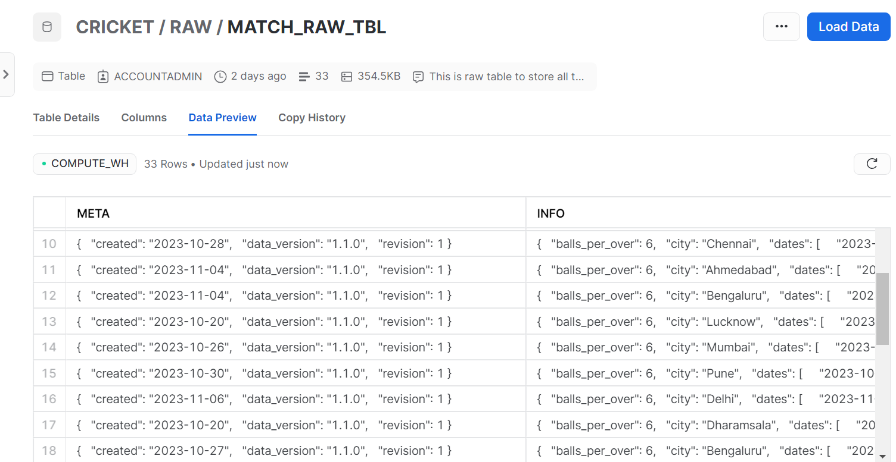
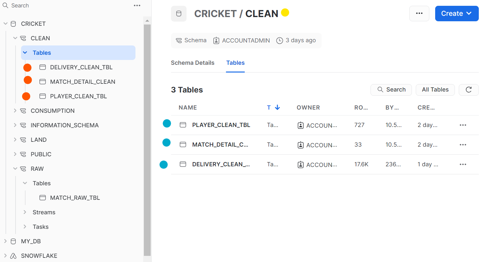
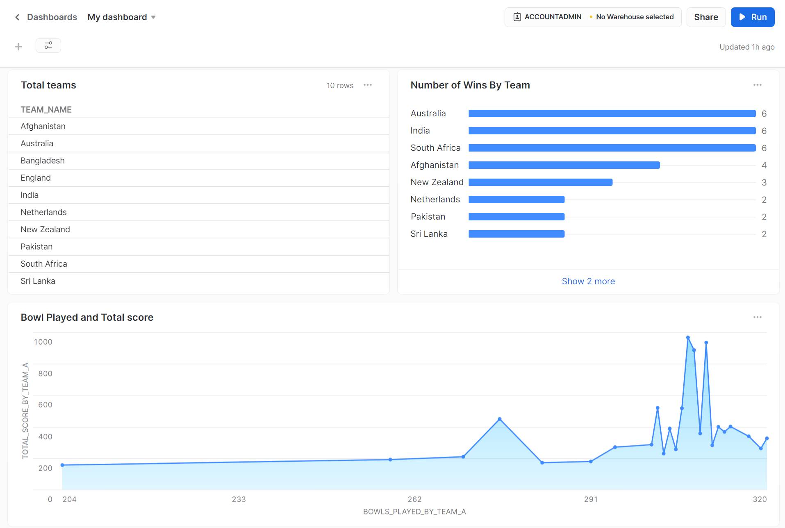
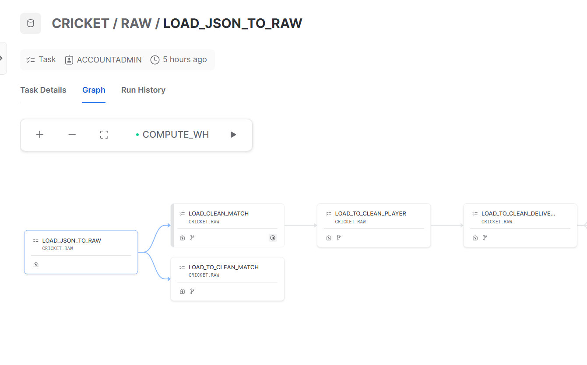
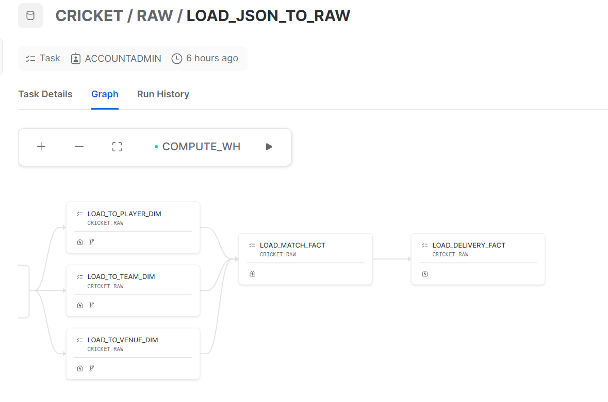

# End-to-End Cricket Analytics Data Engineering Project
<p float="left" >
  
  
    
</p>

## Overview

This repository contains the code and documentation for an end-to-end data engineering project focused on cricket analytics. The project includes the ingestion of data from JSON files, processing it through various layers, and building a consumption layer for analytics. The analytics results can be visualized in a dashboard using Snowsight.

## Project Structure

The project is organized into several layers:

1. **Land Layer**: The initial landing layer where raw data in JSON format is stored.
- Used **Json Cracker** tool to visualize our deeply nested Jsons to understand their structure.
- Created internal Stage and Json File Format to store our Json files in Snowflake.

2. **RAW Layer**: The raw layer stores the ingested data without any transformation. It includes tasks to load data from JSON files into Snowflake tables.

- ingested our data in a Raw Format to MATCH_RAW_TABLE Table


3. **Clean Layer**: The clean layer is responsible for cleaning and transforming the raw data. It includes tasks to create clean tables that are more suitable for analysis.
- Created Three Tables in Clean Schema (Layer): Concerning Player , Match_detail , Delivery Table.

4. **Consumption Layer**: The consumption layer is designed for analytics and reporting. It includes the final tables and views that are used for creating dashboards.
- Use Data Modeling to build our Datawarehouse Facts and dimensions.


5. **Dashboard**: The dashboard layer utilizes Snowsight to visualize the analytics results. It can be accessed for insightful data analysis and reporting.


5. **Automate Continuous Data Flow**: automating continuous data flow, specifically by creating automated tasks to listen to change data capture (CDC) and update data in all tables.




## Getting Started

### Prerequisites

- Snowflake account (Free Trial Account sufficient)
- Snowflake client (SnowSQL or Snowflake web interface)
- Access to Snowsight for dashboard creation

### Setup

1. Clone this repository:

    ```bash
    git clone https://github.com/mehdi-touil/End-to-End-Cricket-Analytics-Data-Engineering-Project
    ```

2. Execute the SQL scripts in each layer (Land, RAW, Clean, Consumption) in the correct order to create tables, streams, tasks, and views.

3. Load data into the Land Layer using tasks or other data loading methods.

4. Run the tasks in the RAW Layer to move data from the Land Layer to the RAW Layer.

5. Run subsequent tasks for cleaning and transforming data in the Clean Layer.

6. Finally, execute the tasks in the Consumption Layer to create the final tables and views for analytics.

7. Use Snowsight to access the dashboard and visualize the cricket analytics.

## Folder Structure

- `Json Cricket files/`: Contains our Json Files.
- `Sql Worksheet/`: Contains the SQL scripts used in all layers.
- `dashboard/`: Includes Screenshots and Sql Scripts related to the dashboard creation using Snowsight.

## Additional Notes

- Customize the SQL scripts based on your specific project requirements.
- Ensure proper access control and permissions are set in Snowflake.
- Refer to Snowflake documentation for detailed information on SnowSQL, Snowsight, and other Snowflake features.

